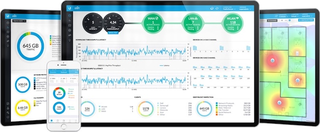

# Community Hass.io Add-ons: UniFi Controller

[![GitHub Release][releases-shield]][releases]
![Project Stage][project-stage-shield]
[![License][license-shield]](LICENSE.md)

[![GitLab CI][gitlabci-shield]][gitlabci]
![Project Maintenance][maintenance-shield]
[![GitHub Activity][commits-shield]][commits]

[![Bountysource][bountysource-shield]][bountysource]
[![Discord][discord-shield]][discord]
[![Community Forum][forum-shield]][forum]

[![Buy me a coffee][buymeacoffee-shield]][buymeacoffee]

The UniFi Controller allows you to manage your UniFi network
using a web browser.



## About

This add-on runs Ubiquiti Networks' UniFi Controller software, which allows
you to manage your UniFi network via the web browser. The add-on provides a
single-click installation and run solution for Hass.io, allowing users to get
their network up, running, and updated, easily.

This add-on supports all Hass.io supported architectures, including the
Raspberry Pi.

## Installation

The installation of this add-on is pretty straightforward and not different in
comparison to installing any other Hass.io add-on.

1. [Add our Hass.io add-ons repository][repository] to your Hass.io instance.
1. Install the "UniFi Controller" add-on.
1. Start the "UniFi Controller" add-on.
1. Check the logs of the "UniFi Controller" to see if everything went well.
1. Click the "OPEN WEB UI" button, and follow the initial wizard.
1. After completing the wizard, log in with the credentials just created.
1. Go to the settings (gears icon in the bottom left) -> Controller (tab).
1. Change the `Controller Hostname/IP` to match the IP or hostname of
   the device running Hass.io.
1. Check the box `Override inform host with controller hostname/IP`.
1. Hit the "Apply Changes" button to activate the settings.
1. Ready to go!

**NOTE**: Do not add this repository to Hass.io, please use:
`https://github.com/hassio-addons/repository`.

## Docker status

![Supports armhf Architecture][armhf-shield]
![Supports aarch64 Architecture][aarch64-shield]
![Supports amd64 Architecture][amd64-shield]
![Supports i386 Architecture][i386-shield]

[![Docker Layers][layers-shield]][microbadger]
[![Docker Pulls][pulls-shield]][dockerhub]

## Configuration

**Note**: _Remember to restart the add-on when the configuration is changed._

Example add-on configuration:

```json
{
    "log_level": "info",
    "ssl": true,
    "certfile": "fullchain.pem",
    "keyfile": "privkey.pem"
}
```

**Note**: _This is just an example, don't copy and past it! Create your own!_

### Option: `log_level`

The `log_level` option controls the level of log output by the addon and can
be changed to be more or less verbose, which might be useful when you are
dealing with an unknown issue. Possible values are:

- `trace`: Show every detail, like all called internal functions.
- `debug`: Shows detailed debug information.
- `info`: Normal (usually) interesting events.
- `warning`: Exceptional occurrences that are not errors.
- `error`:  Runtime errors that do not require immediate action.
- `fatal`: Something went terribly wrong. Add-on becomes unusable.

Please note that each level automatically includes log messages from a
more severe level, e.g., `debug` also shows `info` messages. By default,
the `log_level` is set to `info`, which is the recommended setting unless
you are troubleshooting.

### Option: `ssl`

Enables/Disables the use of a custom SSL (HTTPS) certificate with the in UniFi
web interface. Set it `true` to enable it, `false` otherwise.

**Note**: _When leaving this option disabled, UniFi will use a
custom/self-signed SSL certificate._

### Option: `certfile`

The certificate file to use for SSL.

**Note**: _The file MUST be stored in `/ssl/`, which is the default for Hass.io_

### Option: `keyfile`

The private key file to use for SSL.

**Note**: _The file MUST be stored in `/ssl/`, which is the default for Hass.io_

## Automated backups

The UniFi Controller ships with an automated backup feature. This feature works
but has been adjusted to put the created backups in a different location.

Backups are created in `/backup/unifi`. You can access this folder using
the normal Hass.io methods (e.g., using Samba, Terminal, SSH).

## Known issues and limitations

- The AP seems stuck in "adopting" state: Please read the installation
  instructions carefully. You need to change some controller settings
  in order for this add-on to work properly.
- This add-on does support ARM-based devices, nevertheless, they must
  at least be an ARMv7 device. (Raspberry Pi 1 and Zero is not supported).
- When using SSL, the following warning is shown in the add-on logs:
  `Warning: The JKS keystore uses a proprietary format.`. This warning can
  be safely ignored. There is nothing wrong and your add-on will function
  normally.
- Due limitation, renewed SSL certificates are not picked up automatically.
  You'd have to restart the add-on in order for UniFi to pick up the change.
- Due to security policies in the UniFi Controller software, it is currently
  impossible to add the UniFI web interface to your Home Assistant frontend
  using a `panel_iframe`.
- The broadcast feature of the EDU type APs are currently not working with
  this add-on. Due to a limitation in Hass.io, is it currently impossible
  to open the required "range" of ports needed for this feature to work.

## Changelog & Releases

This repository keeps a change log using [GitHub's releases][releases]
functionality. The format of the log is based on
[Keep a Changelog][keepchangelog].

Releases are based on [Semantic Versioning][semver], and use the format
of ``MAJOR.MINOR.PATCH``. In a nutshell, the version will be incremented
based on the following:

- ``MAJOR``: Incompatible or major changes.
- ``MINOR``: Backwards-compatible new features and enhancements.
- ``PATCH``: Backwards-compatible bugfixes and package updates.

## Support

Got questions?

You have several options to get them answered:

- The Home Assistant [Community Forum][forum], we have a
  [dedicated topic][forum] on that forum regarding this add-on.
- The Home Assistant [Discord Chat Server][discord] for general Home Assistant
  discussions and questions.
- Join the [Reddit subreddit][reddit] in [/r/homeassistant][reddit]

You could also [open an issue here][issue] GitHub.

## Contributing

This is an active open-source project. We are always open to people who want to
use the code or contribute to it.

We have set up a separate document containing our
[contribution guidelines](CONTRIBUTING.md).

Thank you for being involved! :heart_eyes:

## Authors & contributors

The original setup of this repository is by [Franck Nijhof][frenck].

For a full list of all authors and contributors,
check [the contributor's page][contributors].

## We have got some Hass.io add-ons for you

Want some more functionality to your Hass.io Home Assistant instance?

We have created multiple add-ons for Hass.io. For a full list, check out
our [GitHub Repository][repository].

## License

MIT License

Copyright (c) 2018 Franck Nijhof

Permission is hereby granted, free of charge, to any person obtaining a copy
of this software and associated documentation files (the "Software"), to deal
in the Software without restriction, including without limitation the rights
to use, copy, modify, merge, publish, distribute, sublicense, and/or sell
copies of the Software, and to permit persons to whom the Software is
furnished to do so, subject to the following conditions:

The above copyright notice and this permission notice shall be included in all
copies or substantial portions of the Software.

THE SOFTWARE IS PROVIDED "AS IS", WITHOUT WARRANTY OF ANY KIND, EXPRESS OR
IMPLIED, INCLUDING BUT NOT LIMITED TO THE WARRANTIES OF MERCHANTABILITY,
FITNESS FOR A PARTICULAR PURPOSE AND NONINFRINGEMENT. IN NO EVENT SHALL THE
AUTHORS OR COPYRIGHT HOLDERS BE LIABLE FOR ANY CLAIM, DAMAGES OR OTHER
LIABILITY, WHETHER IN AN ACTION OF CONTRACT, TORT OR OTHERWISE, ARISING FROM,
OUT OF OR IN CONNECTION WITH THE SOFTWARE OR THE USE OR OTHER DEALINGS IN THE
SOFTWARE.

[aarch64-shield]: https://img.shields.io/badge/aarch64-yes-green.svg
[amd64-shield]: https://img.shields.io/badge/amd64-yes-green.svg
[anchore-shield]: https://anchore.io/service/badges/image/67d1185473090e99d5ac5e1bb4d1aa2295117a9bd3d7abbf8cd8a71e331c8388
[anchore]: https://anchore.io/image/dockerhub/hassioaddons%2Funifi%3Alatest
[armhf-shield]: https://img.shields.io/badge/armhf-yes-green.svg
[bountysource-shield]: https://img.shields.io/bountysource/team/hassio-addons/activity.svg
[bountysource]: https://www.bountysource.com/teams/hassio-addons/issues
[buymeacoffee-shield]: https://www.buymeacoffee.com/assets/img/guidelines/download-assets-sm-2.svg
[buymeacoffee]: https://www.buymeacoffee.com/frenck
[commits-shield]: https://img.shields.io/github/commit-activity/y/hassio-addons/addon-unifi.svg
[commits]: https://github.com/hassio-addons/addon-unifi/commits/master
[contributors]: https://github.com/hassio-addons/addon-unifi/graphs/contributors
[discord-shield]: https://img.shields.io/discord/330944238910963714.svg
[discord]: https://discord.gg/c5DvZ4e
[dockerhub]: https://hub.docker.com/r/hassioaddons/unifi
[forum-shield]: https://img.shields.io/badge/community-forum-brightgreen.svg
[forum]: https://community.home-assistant.io/t/community-hass-io-add-on-unifi-controller/56297?u=frenck
[frenck]: https://github.com/frenck
[gitlabci-shield]: https://gitlab.com/hassio-addons/addon-unifi/badges/master/pipeline.svg
[gitlabci]: https://gitlab.com/hassio-addons/addon-unifi/pipelines
[home-assistant]: https://home-assistant.io
[i386-shield]: https://img.shields.io/badge/i386-yes-green.svg
[issue]: https://github.com/hassio-addons/addon-unifi/issues
[keepchangelog]: http://keepachangelog.com/en/1.0.0/
[layers-shield]: https://images.microbadger.com/badges/image/hassioaddons/unifi.svg
[license-shield]: https://img.shields.io/github/license/hassio-addons/addon-unifi.svg
[maintenance-shield]: https://img.shields.io/maintenance/yes/2018.svg
[microbadger]: https://microbadger.com/images/hassioaddons/unifi
[project-stage-shield]: https://img.shields.io/badge/project%20stage-experimental-yellow.svg
[pulls-shield]: https://img.shields.io/docker/pulls/hassioaddons/unifi.svg
[reddit]: https://reddit.com/r/homeassistant
[releases-shield]: https://img.shields.io/github/release/hassio-addons/addon-unifi.svg
[releases]: https://github.com/hassio-addons/addon-unifi/releases
[repository]: https://github.com/hassio-addons/repository
[semver]: http://semver.org/spec/v2.0.0.htm
